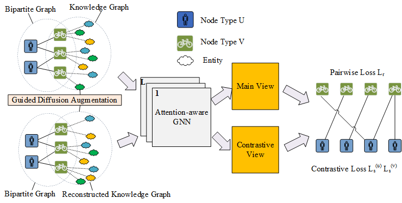
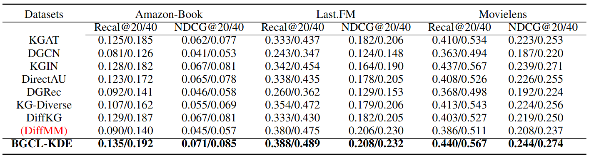

### BGCL_KDE



 [DiffKG] The predecessor of this work: [**DiffKG: Knowledge Graph Diffusion Model for Recommendation**](https://arxiv.org/pdf/2312.16890.pdf) can be found [here](https://github.com/HKUDS/DiffKG).

## 📝 Environment

We develop our codes in the following environment or install all dependencies listed in *requirements.txt*:

- CUDA==12.1

- python==3.9.21

- torch==2.3.1

  

## 📚 Datasets

| Statistics          | Amazon-Book | Movielens | Last.FM |
| ------------------- | ----------- | --------- | ------- |
| # Users             | 70,679      | 37,385    | 1,872   |
| # Items             | 24915       | 6,182     | 3,846   |
| # Interactions      | 846,434     | 539,300   | 42,346  |
| **Knowledge Graph** |             |           |         |
| # Entities          | 113,487     | 24,536    | 9,366   |
| # Relations         | 39          | 20        | 60      |
| # Triplets          | 2,557,746   | 237,155   | 15,518  |

## 🚀 How to run the codes

The command lines to train BGCL-KDE on the three datasets are as below. The un-specified hyperparameters in the commands are set as default.

##### Last.FM

```python
python Main.py --data music --e_loss 0.1 --temp 1.0 --ssl_reg 0.001 --mess_dropout_rate 0.2 --res_lambda 1 --epsilon 0.5 --epoch 100 --rebuild_k 4 --steps 10
```

##### Amazon-Book

```python
python Main.py --data book --e_loss 0.1 --temp 0.5 --ssl_reg 1.0 --mess_dropout_rate 0.2 --res_lambda 1 --epsilon 0.5 --rebuild_k 2 --steps 5 --similarity 80_10_1
```

##### Movielens

```python
python Main.py --data movie --e_loss 0.1 --temp 0.5 --ssl_reg 0.01 --mess_dropout_rate 0.2 --res_lambda 1 --epsilon 0.4 --steps 5 --similarity 80_8_2
```

## 👉 Code Structure

```
.
├── README.md
├── BGCL-KDE.png
├── performance.png
├── Main.py
├── Model.py
├── Params.py
├── DataHandler.py
├── Utils
│   ├── TimeLogger.py
│   └── Utils.py
└── Datasets
    ├── amazon-book
    │   ├── trnMat.pkl
    │   ├── tstMat.pkl
    │   ├── kg.txt
    |   └── Similarity.pkl  
    ├── movielens
    │   ├── trnMat.pkl
    │   ├── tstMat.pkl
    │   ├── kg.txt
    |   └── Similarity.pkl 
    └── ...
```

## 🎯 Experimental Results

Performance comparison of baselines on different datasets in terms of Recall@20 and NDCG@20:

